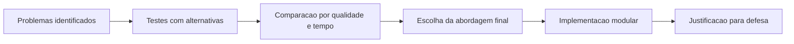
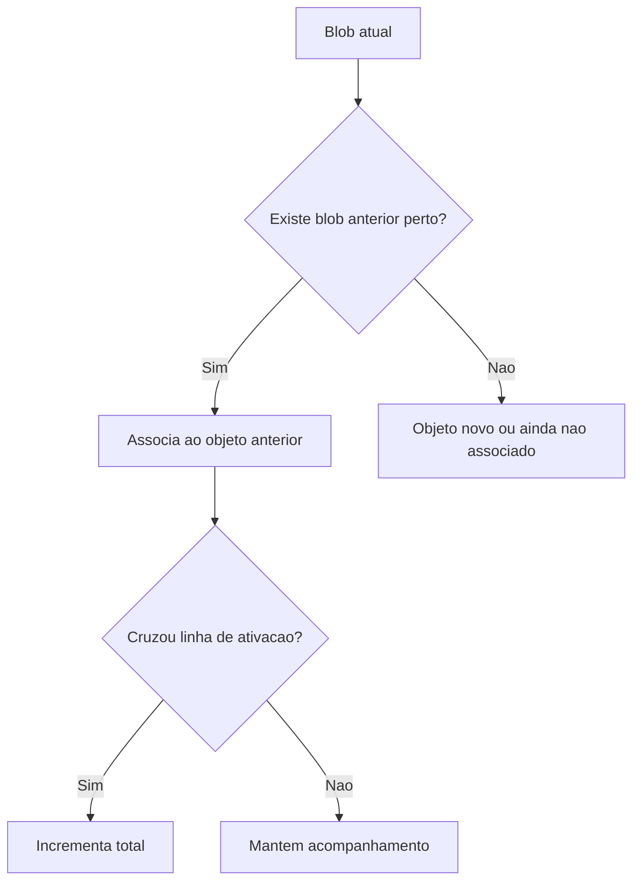
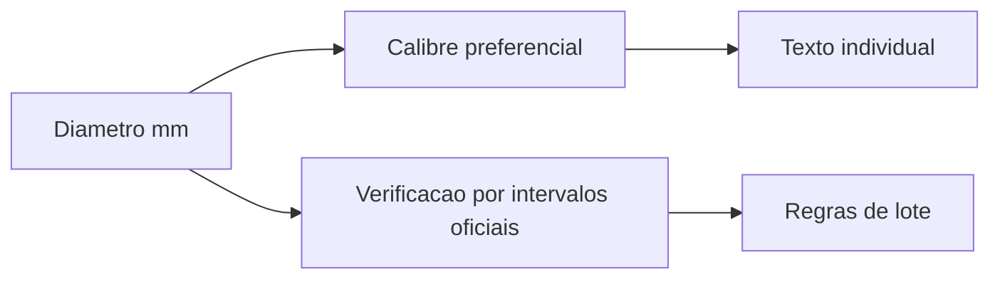
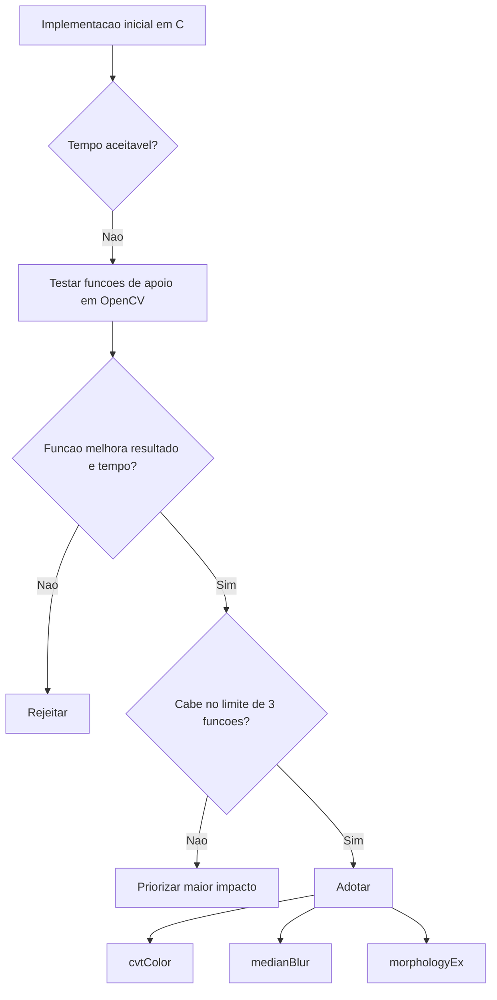
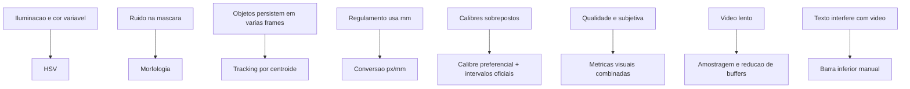

# Decisoes Tecnicas

## Objetivo do Documento

Este documento descreve e justifica as principais decisoes tecnicas tomadas durante o desenvolvimento do projeto. A analise parte dos problemas identificados durante a implementacao e explica porque a solucao final foi organizada e implementada da forma atual.

O foco nao e apenas indicar "o que foi feito", mas tambem explicar porque algumas alternativas foram testadas e rejeitadas. Isto e importante para a defesa do projeto, porque muitas decisoes resultaram de compromissos entre robustez visual, desempenho, simplicidade, interpretacao do regulamento e restricoes do enunciado.

## Criterios Usados nas Decisoes

As decisoes foram avaliadas com base nos seguintes criterios:

| Criterio | Pergunta principal |
|---|---|
| Robustez visual | Funciona ao longo do video inteiro ou apenas em frames especificas? |
| Estabilidade das medicoes | Mantem area, perimetro, bounding box e diametro relativamente consistentes? |
| Desempenho | Permite executar o video de forma fluida? |
| Explicabilidade | E facil explicar e defender na apresentacao? |
| Aderencia ao regulamento | Permite aplicar as regras de calibre, homogeneidade, tolerancias e categoria? |
| Restricao OpenCV | Evita aumentar o uso de funcoes OpenCV fora do necessario? |
| Modularidade | Mantem responsabilidades separadas por ficheiro/modulo? |

## Visao Geral das Decisoes



## Decisao 1: Usar Segmentacao em HSV

### Problema

A primeira dificuldade foi separar as laranjas do fundo de forma estavel. A cor das laranjas varia ao longo do video por causa de iluminacao, sombras, reflexos, compressao e movimento. Segmentacao direta em RGB mostrou-se demasiado sensivel a essas variacoes.

### Alternativas Testadas

Durante o desenvolvimento foram testadas varias abordagens inspiradas nas funcoes existentes em `vc.c` e nas funcoes feitas em aula:

- separacao por canais RGB;
- conversao RGB para escala de cinzentos;
- threshold manual em escala de cinzentos;
- threshold por media global;
- threshold por intervalo;
- threshold local/midpoint;
- conversao para HSV;
- segmentacao por intervalos HSV;
- equalizacao de histograma;
- filtros passa-baixo antes de segmentar;
- filtros passa-alto/arestas para tentar separar contornos;
- ajustes de saturacao e valor.

### Comparacao Visual das Alternativas

A tabela seguinte resume a avaliacao qualitativa feita durante os testes. A escala vai de 1 a 5, onde 5 representa melhor comportamento.

| Abordagem testada | Robustez a iluminacao | Qualidade da mascara | Estabilidade das medicoes | Desempenho | Resultado global |
|---|---:|---:|---:|---:|---:|
| RGB por canal | 2 | 2 | 2 | 5 | 2 |
| Gray + threshold fixo | 1 | 2 | 2 | 5 | 2 |
| Gray + media global | 2 | 2 | 2 | 4 | 2 |
| Threshold local | 3 | 2 | 2 | 2 | 2 |
| Histograma/equalizacao | 3 | 2 | 2 | 2 | 2 |
| Filtros espaciais antes da segmentacao | 3 | 3 | 2 | 2 | 3 |
| Filtros de arestas/alta frequencia | 1 | 1 | 1 | 2 | 1 |
| HSV + intervalo de cor | 4 | 4 | 4 | 4 | 4 |

### Representacao Relativa do Desempenho

```text
Mais rapido                                      Mais lento
RGB por canal          ██████████
Gray threshold         ██████████
HSV threshold          ████████
Media global           ███████
Filtros espaciais      ████
Histograma/equalizacao ███
Threshold local        ██
Arestas/frequencia     ██
```

Esta representacao e relativa aos testes praticos feitos durante o desenvolvimento. Nao corresponde a tempos absolutos cronometrados, mas resume a percecao de custo computacional observada ao executar o video.

### Decisao

Foi escolhido o espaco HSV com segmentacao por intervalo de matiz, saturacao e valor.

### Justificacao

HSV separa melhor a componente de cor da componente de luminosidade. Isto ajudou a isolar as laranjas mesmo quando havia alteracoes moderadas de iluminacao. A segmentacao em HSV tambem se mostrou suficientemente rapida para video e produziu mascaras mais estaveis do que as alternativas baseadas apenas em RGB ou escala de cinzentos.

Optou-se por nao adicionar uma cadeia mais pesada de filtros, histogramas ou equalizacoes na segmentacao principal porque esses metodos aumentavam o custo temporal e, em varios testes, nao melhoravam de forma consistente a mascara final. Em alguns casos ate amplificavam ruido ou deformavam os blobs.

## Decisao 2: Manter a Segmentacao Principal Objetiva e Controlavel

### Problema

Havia muitas funcoes disponiveis em `vc.c`, incluindo varias versoes feitas por diferentes elementos do grupo. Isso permitiu testar muitos metodos, mas tambem criou o risco de construir uma pipeline demasiado longa, dificil de explicar e lenta.

### Funcoes e Familias Testadas

| Familia de funcoes em `vc.c` | Exemplos | Observacao durante os testes |
|---|---|---|
| RGB para cinzento | `vc_rgb_to_gray_*`, `vc_color_to_gray_*` | Util para analises auxiliares, mas fraco para segmentar a laranja no video completo. |
| RGB para HSV | `vc_rgb_to_hsv_*`, `vc_rgb_to_hsv` | Melhor separacao da cor da laranja. |
| Segmentacao HSV | `vc_hsv_segmentation_*`, `vc_hsv_segmentation` | Melhor compromisso entre mascara e tempo. |
| Thresholds binarios | `vc_gray_to_binary_*` | Rapidos, mas demasiado dependentes da iluminacao. |
| Thresholds locais | `vc_gray_to_binary_midpoint`, `bernsen`, `niblack` | Mais pesados e instaveis para este fundo/video. |
| Morfologia | `vc_image_open`, `vc_image_close`, dilate/erode | Importante para limpeza, mas kernels mal escolhidos deformam objetos. |
| Histogramas | `vc_gray_histogram_*`, equalizacao | Uteis para estudo, mas nao resolveram melhor a segmentacao principal. |
| Arestas | `vc_gray_edge_prewitt_*` | Uteis para textura/categoria, nao para segmentar o fruto completo. |
| Filtros passa-baixo | media, mediana, gaussiano | Reduzem ruido, mas podem suavizar/deformar fronteiras. |
| Filtros passa-alto | highpass/enhance | Destacam ruido e textura, nao geram mascara robusta do fruto. |

### Matriz de Decisao

| Solucao candidata | Vantagem | Problema observado | Decisao |
|---|---|---|---|
| Pipeline longa com varios filtros | Poderia tratar varios casos especificos | Mais lenta e menos previsivel | Rejeitada |
| Segmentacao por cinzento | Simples e rapida | Sensivel a iluminacao e fundo | Rejeitada |
| Segmentacao por HSV + limpeza morfologica | Boa separacao e custo controlado | Requer parametros bem escolhidos | Adotada |
| Segmentacao por arestas | Destaca contornos | Nao preenche objetos e cria muitos falsos positivos | Rejeitada |
| Segmentacao com equalizacao | Pode melhorar contraste | Alterou ruido e nao estabilizou o video | Rejeitada |

### Justificacao

A decisao foi manter a segmentacao principal baseada em HSV e limpeza posterior, porque essa abordagem foi a que melhor equilibrou desempenho, estabilidade e facilidade de defesa. O facto de existirem muitas funcoes em `vc.c` nao significa que todas devam entrar na solucao final. O objetivo foi escolher as funcoes que melhor serviam o problema, e nao acumular etapas sem beneficio consistente.

## Decisao 3: Usar Morfologia para Limpar a Mascara

### Problema

A mascara binaria inicial podia conter ruido, pequenos buracos nas laranjas ou zonas fragmentadas.

### Alternativas

| Alternativa | Efeito esperado | Problema |
|---|---|---|
| Sem morfologia | Preserva exatamente a segmentacao original | Mantem ruido e buracos |
| Apenas abertura | Remove pequenos ruidos | Pode reduzir partes validas da laranja |
| Apenas fecho | Preenche falhas | Pode unir zonas proximas indevidamente |
| Fecho seguido de abertura | Preenche falhas e remove ruido residual | Requer kernels equilibrados |

### Decisao

Foi usada uma limpeza morfologica depois da segmentacao.

### Justificacao

A morfologia tornou os blobs mais consistentes para medicao. Sem esta etapa, area, perimetro e bounding box variavam mais. Foram evitados kernels excessivamente grandes, porque deformavam as laranjas e afetavam diretamente diametro e calibre.

## Decisao 4: Reutilizar Menos Imagens Temporarias

### Problema

Inicialmente existiam mais imagens auxiliares do que o necessario. Algumas imagens eram criadas para testes ou etapas que deixaram de ser usadas no pipeline final.

### Comparacao

| Estado | Imagens IVC usadas no `main.cpp` | Observacao |
|---|---:|---|
| Versao inicial | 7 | Incluia buffers nao usados ou redundantes. |
| Versao final | 4 | Mantem apenas imagem RGB, HSV, mascara e etiquetas. |

### Decisao

Foram mantidas apenas:

- `image`;
- `imageHSV`;
- `imageSEG`;
- `imageLabels`.

### Justificacao

Esta reducao diminuiu memoria auxiliar, simplificou o fluxo e evitou copias desnecessarias. As imagens removidas nao acrescentavam informacao ao resultado final.

## Decisao 5: Usar Blobs e Componentes Conexas

### Problema

Depois da segmentacao, era necessario transformar a mascara binaria em objetos individuais com medidas proprias.

### Alternativas

| Alternativa | Vantagem | Limitacao |
|---|---|---|
| Contar pixeis diretamente na mascara | Simples | Nao distingue laranjas individuais |
| Contornos apenas | Pode medir forma | Mais sensivel a ruido de fronteira |
| Componentes conexas/blobs | Separa objetos e permite medir cada um | Depende da qualidade da mascara |

### Decisao

Foi usada etiquetagem de componentes conexas para gerar blobs.

### Justificacao

Os blobs permitem associar a cada laranja uma area, perimetro, bounding box, centro de massa e etiqueta. Esta representacao e adequada para medicao, tracking e classificacao.

## Decisao 6: Otimizar a Medicao dos Blobs

### Problema

A funcao de medicao pode tornar-se pesada se a imagem for percorrida varias vezes, especialmente quando ha varios blobs.

### Comparacao

| Estrategia | Custo aproximado | Problema |
|---|---|---|
| Percorrer a imagem uma vez por blob | `largura * altura * nblobs` | Cresce com o numero de blobs |
| Percorrer a imagem uma vez e atualizar todos os blobs | `largura * altura` | Mais eficiente |

### Decisao

A medicao dos blobs foi organizada para calcular informacao de todos os blobs numa passagem pela imagem de etiquetas.

### Justificacao

Esta abordagem reduz custo temporal e evita que ruido ou varios componentes pequenos multipliquem o trabalho por frame.

## Decisao 7: Tracking por Centroide

### Problema

A mesma laranja aparece em varias frames. Sem tracking, a contagem total seria duplicada.

### Alternativas

| Metodo | Vantagem | Problema |
|---|---|---|
| Contar todos os blobs em todos os frames | Muito simples | Conta a mesma laranja varias vezes |
| Tracking por centroide | Rapido e explicavel | Pode falhar se houver saltos grandes |
| Tracking com descritores visuais | Mais robusto em casos complexos | Mais pesado e desnecessario para este video |
| Optical flow/modelos de movimento | Mais sofisticado | Excede a complexidade necessaria |

### Decisao

Foi usado tracking por distancia entre centroides e uma linha de ativacao.

### Justificacao

O movimento das laranjas no video e relativamente regular. A distancia entre centroides foi suficiente para associar objetos entre frames. A linha de ativacao permite contar cada laranja uma unica vez quando entra na zona de interesse.



## Decisao 8: Definir Linha de Ativacao e Linha de Desativacao

### Problema

Era necessario escolher uma zona do video onde as laranjas fossem avaliadas. No inicio ou no fim do enquadramento, os objetos podem estar parciais, instaveis ou sobrepostos com informacao visual.

### Decisao

Foi usada uma linha de ativacao superior para contagem e uma linha inferior de desativacao. A linha inferior foi ajustada para ficar acima da barra de informacao.

### Justificacao

Esta decisao evita avaliar laranjas em zonas menos fiaveis do video. Tambem impede que a barra inferior de visualizacao interfira com a zona util de analise.

## Decisao 9: Conversao Pixel/Milimetro por Escala Fixa

### Problema

O regulamento usa diametros em milimetros, mas o video fornece medidas em pixeis.

### Decisao

Foi usada a escala:

```text
280 px = 55 mm
```

### Justificacao

Esta escala permite converter largura, perimetro e area para unidades fisicas aproximadas. Embora uma calibracao industrial completa fosse mais rigorosa, a escala fixa e adequada ao contexto do trabalho e permite aplicar as regras regulamentares.

## Decisao 10: Calibre Preferencial e Intervalos Sobrepostos

### Problema

Os intervalos de calibre do regulamento sobrepoem-se. Um mesmo diametro pode pertencer a mais do que um calibre.

### Decisao

Foram implementadas duas ideias:

- `orangeCaliber`: devolve um calibre preferencial para apresentar uma classificacao individual;
- `orangeFitsCaliber`: verifica se um diametro pertence ao intervalo oficial de um calibre.

### Justificacao

Esta separacao permite mostrar um calibre unico por laranja, mas ao mesmo tempo respeitar os intervalos oficiais quando se avalia lote, homogeneidade e tolerancias.



## Decisao 11: Homogeneidade pelo Lote do Video

### Problema

O regulamento fala em frutos de uma mesma embalagem/lote. No projeto, o video representa uma sequencia de frutos.

### Decisao

O video foi tratado como um lote.

### Justificacao

Esta interpretacao permite aplicar as regras de homogeneidade de forma coerente. O sistema acumula os diametros das laranjas contadas e compara menor e maior diametro com o limite permitido para o calibre representativo.

## Decisao 12: Tolerancia de Calibre por Regra do Minimo a Granel

### Problema

O regulamento apresenta mais do que uma regra de tolerancia de calibre. Uma delas refere o calibre mencionado na embalagem/documentos. Outra refere apresentacao a granel com exigencia do calibre minimo.

### Decisao

Foi adotada a regra do minimo para apresentacao a granel:

- laranjas com diametro >= 53 mm cumprem;
- laranjas entre 50 mm e 52 mm entram na tolerancia de 10%;
- laranjas abaixo de 50 mm invalidam a tolerancia.

### Justificacao

O video simula frutos a circular num sistema tipo tapete rolante, sem uma embalagem com calibre declarado. Por isso, a regra do minimo a granel encaixa melhor no contexto do projeto.

A abordagem alternativa por calibre mencionado foi mantida comentada no codigo para referencia, porque tambem pertence ao regulamento e foi considerada durante a implementacao.

## Decisao 13: Categoria de Qualidade com Metricas Visuais

### Problema

As categorias do regulamento incluem conceitos qualitativos, como boa qualidade, defeitos ligeiros, coloracao tipica, rugosidade e alteracoes superficiais. Estes conceitos nao sao diretamente numericos.

### Decisao

A categoria individual passou a usar varias metricas visuais:

- circularidade;
- relacao largura/altura;
- preenchimento da bounding box;
- percentagem de cor tipica;
- percentagem de defeito de cor;
- variacao de cor;
- rugosidade;
- densidade de arestas;
- histograma de intensidade;
- contraste por percentis.

### Justificacao

Uma decisao baseada apenas em cor era insuficiente e tendia a classificar demasiadas laranjas como `Extra`. A combinacao de forma, cor e textura permite aproximar melhor os criterios regulamentares.

## Decisao 14: Usar Textura e Arestas de Forma Controlada

### Problema

Filtros de textura e arestas aplicados a toda a imagem aumentavam muito o custo temporal. Ao mesmo tempo, eram importantes para avaliar rugosidade e defeitos superficiais.

### Decisao

A analise de textura foi aplicada dentro da laranja, usando amostragem controlada em vez de varrer todos os pixeis sempre.

### Justificacao

Esta abordagem manteve conceitos de processamento aprendidos nas aulas, como escala de cinzentos, mediana local, histograma e operadores tipo Prewitt/Sobel, mas reduziu o impacto no desempenho.

```text
Analise completa pixel a pixel     ██████████ custo alto
Amostragem dentro do blob          ████       custo controlado
Sem textura/arestas                █          custo baixo, qualidade fraca
```

## Decisao 15: Melhor Categoria Observada na Zona Util

### Problema

A categoria de uma mesma laranja podia oscilar ao longo do video por causa da iluminacao, posicao, sombras e variacao da segmentacao.

### Decisao

Foi guardada a melhor categoria observada enquanto a laranja esta na zona util.

### Justificacao

Isto reduz flutuacoes visuais e evita que uma laranja seja penalizada por frames isolados onde a imagem esta pior. A zona util tambem evita avaliar frutos parcialmente visiveis.

## Decisao 16: Categoria e Tolerancia de Qualidade por Lote

### Problema

O regulamento define tolerancias de qualidade por lote. Classificar apenas cada laranja individualmente nao era suficiente.

### Decisao

O lote tenta ser classificado na melhor categoria possivel, respeitando tolerancias:

| Categoria candidata | Tolerancia implementada |
|---|---|
| Extra | ate 5% podem ser I |
| I | ate 10% podem ser II |
| II | ate 10% podem ficar abaixo |
| III | ate 15% podem ficar abaixo |

### Justificacao

Isto aproxima a avaliacao ao regulamento, que permite uma pequena percentagem de frutos abaixo da categoria declarada. A tolerancia e calculada em numero de frutos, porque o sistema nao mede peso.

As sub-regras relativas ao calice e a defeitos muito especificos nao foram usadas como decisao automatica, porque o video nao permite observar esses atributos de forma fiavel.

## Decisao 17: Nao Detetar Calice Automaticamente

### Problema

O calice pode nao estar visivel, pode estar virado para baixo ou pode parecer apenas uma zona escura/irregular.

### Decisao

O calice nao foi usado como criterio automatico.

### Justificacao

Implementar uma deteccao pouco fiavel do calice poderia piorar a classificacao. Foi preferivel assumir esta limitacao e aplicar apenas as partes do regulamento observaveis no video.

## Decisao 18: Reduzir Uso de OpenCV

### Problema

O enunciado limita o uso de OpenCV. Ao mesmo tempo, algumas tarefas dependem naturalmente de OpenCV, como leitura de video e visualizacao.

### Decisao

OpenCV ficou concentrado no `main.cpp` para:

- leitura do video;
- conversoes de `cv::Mat`;
- algumas operacoes ja usadas;
- visualizacao;
- escrita de texto.

Sempre que possivel, o processamento foi feito em C com `IVC` e `OVC`.

### Justificacao

Esta separacao permite cumprir a restricao do projeto e manter a logica principal controlada pelo grupo.

## Decisao 19: Escolha das Tres Funcoes OpenCV de Processamento

### Problema

O enunciado permitia a utilizacao de ate tres funcoes distintas de OpenCV para alem das funcoes ja presentes no `CodigoExemplo.cpp`. Assim, leitura de video, apresentacao de janelas e funcoes usadas no exemplo nao foram consideradas como parte desse limite. O problema principal foi decidir quais as tres funcoes OpenCV que realmente justificavam ocupar esse limite.

Inicialmente, foram feitas versoes usando apenas funcoes proprias em C, incluindo alternativas de filtragem, morfologia e processamento pixel a pixel. Essas versoes demonstraram que o projeto era tecnicamente possivel sem recorrer a OpenCV para essas etapas, mas o tempo de execucao era demasiado elevado. Em alguns testes, o processamento demorava varios minutos ate aparecer o primeiro fruto de forma utilizavel no video. Isto contrariava o objetivo do enunciado de aproximar a execucao a tempo real.

### Funcoes OpenCV escolhidas

As tres funcoes OpenCV de processamento escolhidas foram:

| Funcao OpenCV | Papel no projeto | Motivo da escolha |
|---|---|---|
| `cvtColor` | Converter `cv::Mat` entre BGR e RGB | Necessaria para compatibilizar o formato de cor do OpenCV com as funcoes C do projeto, que assumem RGB. |
| `medianBlur` | Reduzir ruido na mascara binaria | Remove pequenas irregularidades e ruido impulsivo antes da analise de blobs, com desempenho muito superior as versoes manuais testadas. |
| `morphologyEx` | Aplicar abertura e fecho morfologico | Limpa a mascara e melhora a consistencia dos blobs de forma eficiente, substituindo combinacoes manuais mais lentas de erosao/dilatacao. |

### Justificacao individual

#### `cvtColor`

O OpenCV guarda frames lidas do video em BGR, enquanto as funcoes desenvolvidas no projeto trabalham em RGB. Sem esta conversao, os canais seriam interpretados de forma errada e a segmentacao por cor ficaria instavel.

A decisao de usar `cvtColor` foi tomada porque esta funcao resolve um problema de compatibilidade entre a camada OpenCV e a camada C do projeto. Nao foi usada para substituir a segmentacao; a conversao RGB para HSV continua implementada no modulo C do projeto.

#### `medianBlur`

A mascara binaria apresentava pequenos ruidos e irregularidades que afetavam a etiquetagem de blobs. Foram testadas alternativas manuais com filtros passa-baixo e mediana, inspiradas nas funcoes existentes em `vc.c`.

O problema das versoes manuais foi o custo temporal. Para uma imagem 1280x720, aplicar filtros pixel a pixel em C, frame a frame, tornava a execucao demasiado lenta. `medianBlur` foi escolhida porque melhorou a mascara antes da morfologia e reduziu significativamente o tempo de processamento.

#### `morphologyEx`

As operacoes morfologicas eram necessarias para fechar pequenas falhas nas laranjas e remover ruido residual. Em C, isto obrigava a combinar erosao e dilatacao, com varios ciclos pela imagem.

Foram testadas funcoes proprias de erosao, dilatacao, abertura e fecho. Apesar de funcionarem, o impacto temporal era elevado no video completo. `morphologyEx` foi escolhida porque executa abertura e fecho de forma eficiente e melhora a estabilidade dos blobs, o que afeta diretamente area, perimetro, bounding box, diametro e calibre.

### Comparacao entre versao manual e versao final

| Abordagem | Resultado visual | Desempenho observado | Impacto na defesa |
|---|---|---|---|
| Tudo em C, incluindo filtros e morfologia | Tecnicamente funcional, mas instavel em algumas frames | Muito lento; em testes podia demorar varios minutos ate resultados uteis | Demonstra dominio, mas nao cumpre bem tempo real |
| OpenCV sem criterio, com varias funcoes adicionais | Poderia melhorar algumas etapas | Risco de violar o limite do enunciado | Dificil de defender |
| Tres funcoes escolhidas (`cvtColor`, `medianBlur`, `morphologyEx`) | Mascara mais limpa e blobs mais estaveis | Muito mais proximo de execucao em tempo real | Cumpre limite e justifica bem o compromisso |

### Representacao visual do processo de escolha



### Porque nao foram escolhidas outras funcoes OpenCV

| Tipo de funcao | Porque nao foi adotada |
|---|---|
| Segmentacao pronta de cor | A segmentacao HSV foi implementada em C para manter controlo e cumprir o objetivo do trabalho. |
| Deteccao de contornos OpenCV | A etiquetagem e medicao de blobs foram implementadas no projeto, evitando substituir uma parte central do trabalho. |
| Funcoes de histograma OpenCV | Os histogramas usados na qualidade foram calculados no modulo de classificacao. |
| Filtros adicionais | Aumentariam o uso de OpenCV e nem sempre melhoravam o resultado global. |
| Operacoes avancadas de tracking | O tracking por centroide em C foi suficiente para o video. |

### Conclusao da decisao

As tres funcoes OpenCV escolhidas foram usadas para resolver gargalos praticos muito especificos: compatibilidade de cor, reducao de ruido e limpeza morfologica eficiente. A decisao nao substitui o trabalho principal de Visao por Computador implementado em C; pelo contrario, permitiu que esse trabalho fosse executado de forma suficientemente rapida para se aproximar do requisito de tempo real.

## Decisao 20: Barra Inferior de Informacao sem Novas Funcoes OpenCV

### Problema

Os textos no canto superior esquerdo interferiam visualmente com o video. Ao mesmo tempo, nao se podia aumentar o uso de funcoes OpenCV para desenhar a interface.

### Decisao

A barra inferior foi criada manualmente, escurecendo os pixeis diretamente em `frame.data`. O texto continua a usar `cv::putText`, que ja era usado anteriormente.

### Justificacao

Esta solucao melhora a leitura dos resultados sem introduzir novas funcoes OpenCV como `rectangle`, `addWeighted` ou `clone`.

## Decisao 21: Modularizacao por Responsabilidade

### Problema

Concentrar tudo no `main.cpp` tornava o codigo dificil de ler, testar e defender.

### Decisao

O projeto foi dividido em modulos:

| Modulo | Responsabilidade |
|---|---|
| `tp_segmentation` | Segmentacao e conversoes de cor |
| `tp_measurements` | Blobs e medicoes |
| `tp_tracking` | Associacao temporal e contagem |
| `tp_classification` | Calibre, categoria e lote |
| `tp_visualization` | Desenho manual em `IVC` |
| `tp_utils` | Estruturas e funcoes auxiliares |

### Justificacao

Esta estrutura torna mais claro onde cada problema e tratado. Tambem facilita a defesa, porque cada ficheiro tem uma responsabilidade explicavel.

## Matriz Final de Decisoes

| Area | Problema principal | Decisao final | Motivo principal |
|---|---|---|---|
| Segmentacao | Cor varia com iluminacao | HSV + intervalo | Melhor equilibrio entre robustez e tempo |
| Limpeza | Ruido e falhas na mascara | Morfologia controlada | Melhora blobs sem deformar demasiado |
| Medicao | Varios blobs por frame | Componentes conexas | Permite medir cada laranja |
| Performance | Video lento | Amostragem e menos buffers | Reduz custo por frame |
| Tracking | Contagem duplicada | Centroides + linha | Simples, rapido e suficiente |
| Calibre | Intervalos sobrepostos | Preferencial + fits oficial | Mostra um calibre e respeita intervalos |
| Tolerancia calibre | Regras diferentes | Minimo a granel | Melhor enquadramento no video |
| Categoria | Criterios qualitativos | Forma + cor + textura | Aproximacao mais defensavel |
| Qualidade lote | Tolerancias por categoria | Melhor categoria valida | Respeita percentagens do regulamento |
| Visualizacao | Texto tapava video | Barra inferior manual | Mais legivel sem novas funcoes OpenCV |
| Arquitetura | Codigo concentrado | Modulos por responsabilidade | Mais claro e defensavel |

## Diagrama de Relacao entre Problemas e Decisoes



## Conclusao

As decisoes tecnicas foram orientadas por testes praticos, desempenho e capacidade de defesa. A solucao final nao tenta usar o maior numero possivel de tecnicas, mas sim as tecnicas que apresentaram melhor equilibrio para este video e para os objetivos do enunciado.

O projeto combina metodos vistos nas aulas, como conversoes de cor, segmentacao, morfologia, blobs, histogramas, filtros locais e arestas, mas aplica cada um onde trouxe beneficio real. Esta foi a principal linha de decisao: usar tecnicas suficientes para resolver o problema de forma robusta, sem tornar a execucao lenta ou a solucao dificil de explicar.
