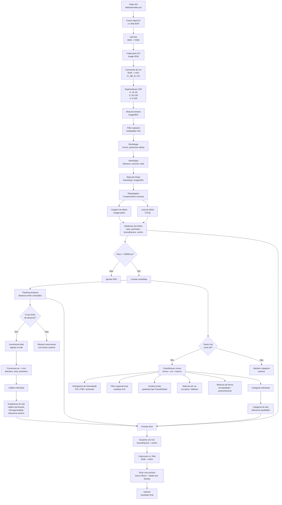
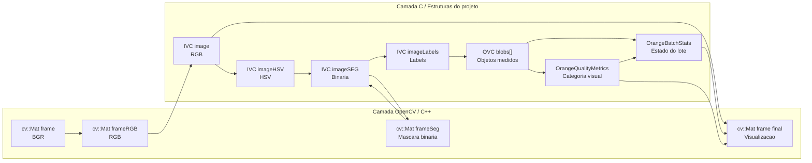
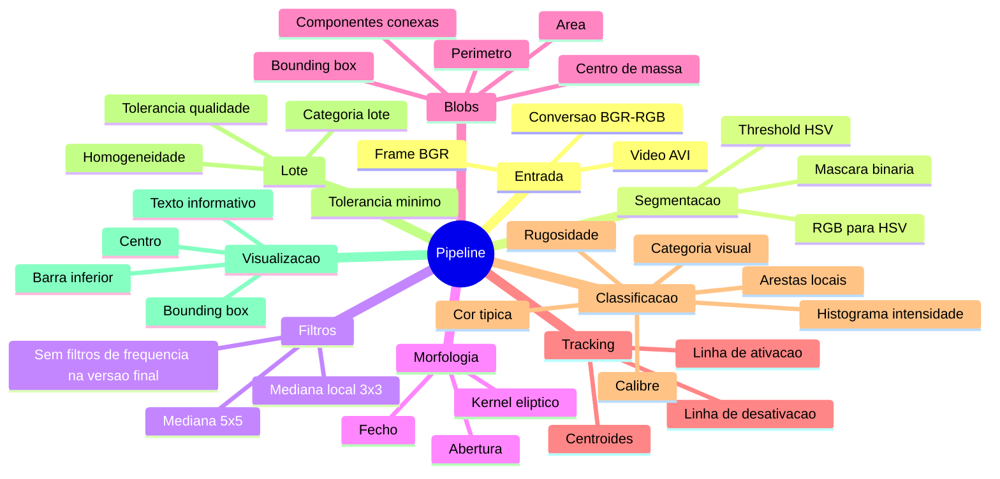
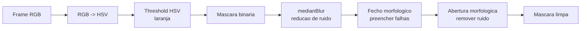
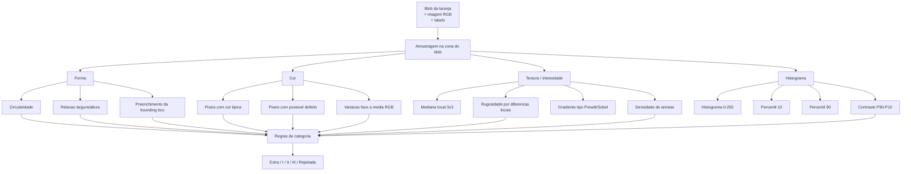
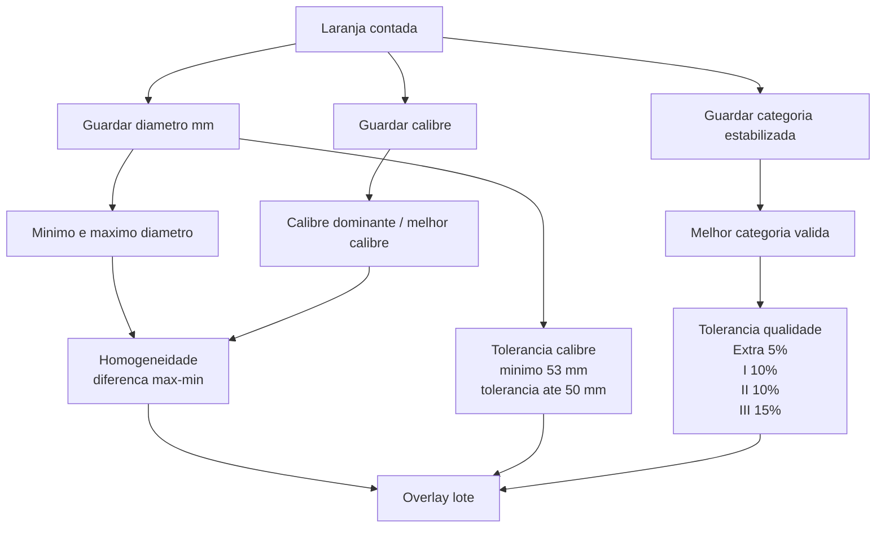

# Pipeline de Processamento

## Diagrama Global

## Diagrama por Tipo de Dados

## Tecnicas Aplicadas no Pipeline

## Subpipeline de Segmentacao

## Subpipeline de Classificacao Visual

## Subpipeline de Lote

